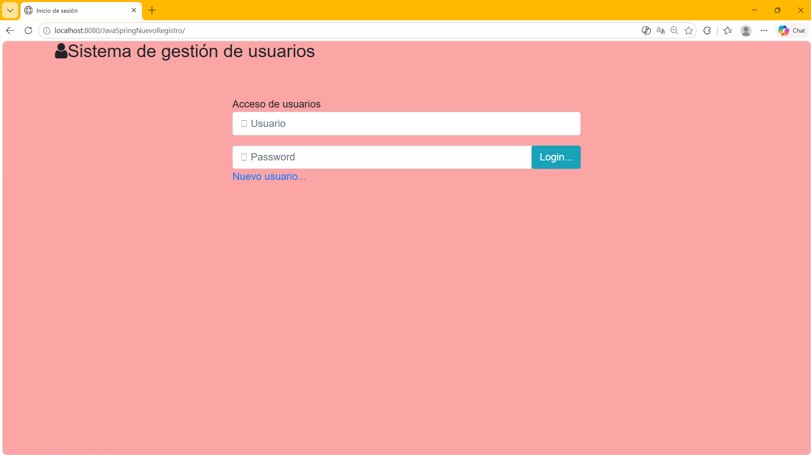
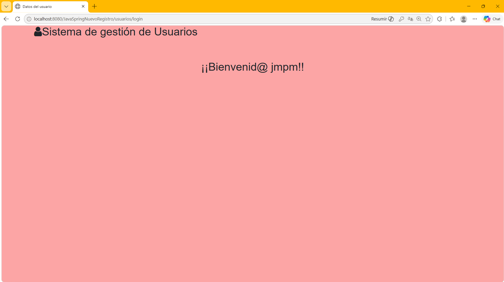

# Sistema de Gestión de Usuarios — Spring MVC 

<p align="center">
  
</p>

Aplicación web desarrollada en Java con Spring MVC que implementa un sistema de registro y login de usuarios. Ejercicio de introducción a Spring MVC con data binding, gestión de formularios y navegación entre vistas JSP.

## 🛠️ Stack Técnico

- **IDE:** Eclipse IDE
- **Lenguaje:** Java 11
- **Framework:** Spring MVC
- **Vistas:** JSP + JSTL + Bootstrap
- **Servidor de aplicaciones:** Apache Tomcat
- **Control de versiones:** Git & GitHub

## 🏗 Arquitectura

El proyecto sigue el patrón **MVC** con configuración por XML:

- **Controlador** (`@Controller`) — `ControladorGestionUsuarios` gestiona todas las peticiones HTTP con `@GetMapping` y `@PostMapping`
- **Data Binding** — `@ModelAttribute` vincula automáticamente los datos del formulario con el objeto `Usuario`
- **Vistas** — páginas JSP configuradas mediante `spring-mvc-servlet.xml` con un `ViewResolver`
- **Entidad** — clase `Usuario` con atributos nombre, apellido, usuario, password, email, dirección y teléfono

## 📂 Estructura del proyecto

```
src/main/java/es/accenture/
├── controladores/
│   └── ControladorGestionUsuarios.java  ← Controlador principal (@Controller)
└── entidades/
    └── Usuario.java                     ← Entidad usuario con getters y setters

src/main/webapp/
├── InicioSesion.jsp                     ← Vista de login
└── WEB-INF/
    ├── NuevoRegistro.jsp                ← Formulario de registro de nuevo usuario
    ├── ConfirmarDatos.jsp               ← Vista de confirmación de datos registrados
    ├── Bienvenida.jsp                   ← Vista de bienvenida tras el login
    ├── spring-mvc-servlet.xml           ← Configuración Spring MVC y ViewResolver
    └── web.xml                          ← Configuración del DispatcherServlet
```

## 🚀 Funcionalidades

- Formulario de inicio de sesión con usuario y contraseña
- Formulario de registro de nuevo usuario con data binding automático (`@ModelAttribute`)
- Vista de confirmación con los datos introducidos en el formulario
- Vista de bienvenida personalizada con el nombre de usuario tras el login
- Navegación entre vistas gestionada por el controlador Spring MVC

## Conceptos aplicados

- `@Controller` y `@RequestMapping` para mapear URLs
- `@GetMapping` y `@PostMapping` para diferenciar peticiones GET y POST
- `@ModelAttribute` para el data binding automático entre formulario y objeto Java
- `Model` para pasar datos del controlador a la vista JSP
- Configuración de Spring MVC mediante XML (`spring-mvc-servlet.xml`)
- `DispatcherServlet` como Front Controller configurado en `web.xml`

## ⚙️ Instalación y ejecución

### Requisitos previos

- Java 11
- Apache Tomcat 9
- Eclipse IDE (con soporte para proyectos web dinámicos)

### 1. Clonar el repositorio

```bash
git clone https://github.com/jorge-martin-perez/JavaSpringNuevoRegistro.git
```

### 2. Desplegar en Eclipse con Tomcat

1. Importa el proyecto en Eclipse como **Dynamic Web Project**
2. Añade el proyecto al servidor Tomcat configurado en Eclipse
3. Inicia el servidor
4. Accede a: `http://localhost:8080/JavaSpringNuevoRegistro/`

## Capturas de pantalla

<p align="center">
  
  <br>
  <em>Pantalla de inicio de sesión</em>
</p>

<p align="center">
  
  <br>
  <em>Pantalla de bienvenida tras el login</em>
</p>
